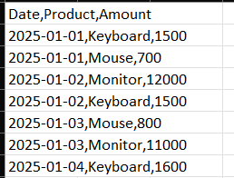
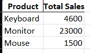
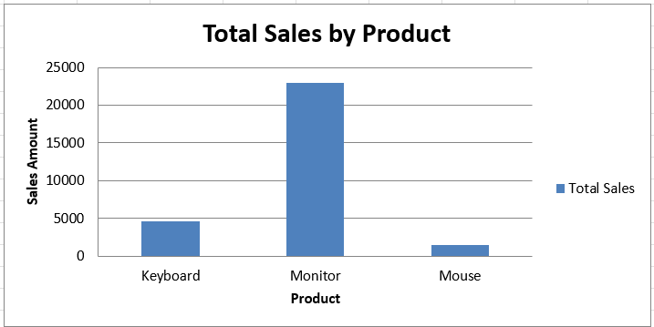

# 📊 Excel Sales Report Automation

A Python project that automates the process of **cleaning, summarizing, and visualizing CSV data** into a **professional Excel report** with colorful charts.  
Perfect for sales data, inventory logs, research datasets, and more.

---

## 🚀 Features
- 📂 **Reads CSV data** and cleans missing or invalid entries  
- 📅 **Converts date columns** into proper formats  
- 📊 **Summarizes data** (e.g., total sales per product)  
- 📈 **Generates professional Excel reports** with charts  
- 🔄 **Fully automated** — from raw CSV to final report in one click

---

## 📂 Example Workflow
1. **Input:** Raw CSV file (`sales_data.csv`)
2. **Processing:**
   - Clean data
   - Group and summarize
   - Create charts
3. **Output:** `sales_report.xlsx` with:
   - Sheet 1 → Cleaned Data  
   - Sheet 2 → Summary Table  
   - Sheet 3 → Sales Chart

---

## 🖼 Screenshots
| Raw Data | Summary Table | Excel Chart |
|----------|--------------|-------------|
|  |  |  |

---

## 🛠 Tech Stack
- **Python 3.x**
- **Pandas** → Data cleaning & summarization  
- **Matplotlib** → Chart creation  
- **OpenPyXL / XlsxWriter** → Excel export

---

## 📦 Installation
1. Clone the repository:
   ```bash
   git clone https://github.com/Tushar_Bagewadi/excel-sales-report-automation.git
